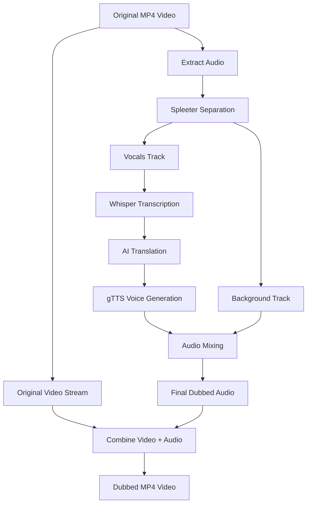

# Dynamic Video Dubbing Implementation Plan

## 🎯 Overview

This document outlines the implementation plan for adding dynamic video dubbing capabilities to the VirtualPyTest restart video system. The dubbing pipeline will separate original audio into voice and background tracks, translate the voice content, generate dubbed speech using gTTS, and mix everything back together while preserving background audio.

## 🏗️ Architecture



## 📦 Dependencies

### Required Python Packages
```bash
# Audio separation (modern AI model)
pip install demucs pydub

# Text-to-Speech (free, no API key needed)
pip install gTTS

# Audio processing (already installed)
# ffmpeg - already available
# moviepy - already in system
```

### System Requirements
- **Storage**: ~500MB for Spleeter models (one-time download)
- **Processing**: CPU-based (works on existing hardware)
- **Internet**: Required for gTTS (minimal bandwidth)

## 🔧 Implementation Plan

### Phase 1: Audio Dubbing Helpers (New Component)

**File**: `backend_host/src/controllers/audiovideo/audio_dubbing_helpers.py`

```python
class AudioDubbingHelpers:
    """Helper class for audio dubbing functionality."""
    
    def __init__(self, av_controller, device_name: str = "DubbingHelper"):
        self.av_controller = av_controller
        self.device_name = device_name
        self._spleeter_separator = None
        
    def separate_audio_tracks(self, audio_file: str) -> Dict[str, str]:
        """Separate audio into vocals and background using Spleeter."""
        
    def generate_dubbed_speech(self, text: str, language: str) -> str:
        """Generate speech from text using gTTS."""
        
    def mix_dubbed_audio(self, background_file: str, dubbed_voice_file: str, 
                        original_duration: float) -> str:
        """Mix background audio with dubbed voice."""
        
    def create_dubbed_video(self, video_file: str, dubbed_audio_file: str) -> str:
        """Combine original video with dubbed audio track."""
```

### Phase 2: Extend VideoRestartHelpers

**File**: `backend_host/src/controllers/audiovideo/video_restart_helpers.py`

Add new method:
```python
def generate_dubbed_restart_video(self, video_id: str, target_language: str, 
                                original_transcript: str) -> Optional[Dict[str, Any]]:
    """
    Generate dubbed version of restart video.
    
    Args:
        video_id: Original video identifier
        target_language: Target language code (e.g., 'es', 'fr', 'de')
        original_transcript: Transcribed text from original audio
        
    Returns:
        Dict with dubbed video URL and processing details
    """
```

### Phase 3: Backend Routes

**File**: `backend_server/src/routes/server_restart_routes.py`

Add new route:
```python
@server_restart_bp.route('/generateDubbedVideo', methods=['POST'])
def generate_dubbed_restart_video():
    """Generate dubbed version of restart video"""
    try:
        data = request.get_json() or {}
        host = data.get('host')
        device_id = data.get('device_id', 'device1')
        video_id = data.get('video_id')
        target_language = data.get('target_language', 'es')
        original_transcript = data.get('original_transcript', '')
        
        # Get AV controller and generate dubbed video
        # Return dubbed video URL and processing details
        
    except Exception as e:
        return jsonify({
            'success': False,
            'error': f'Dubbing generation failed: {str(e)}'
        }), 500
```

### Phase 4: Frontend Integration

#### Extend useRestart Hook

**File**: `frontend/src/hooks/pages/useRestart.ts`

Add dubbing state and methods:
```typescript
interface UseRestartReturn {
  // ... existing properties
  
  // Dubbing state
  dubbedVideos: Record<string, string>; // language -> video_url
  isDubbing: boolean;
  dubbingProgress: DubbingProgress;
  
  // Dubbing methods
  generateDubbedVersion: (language: string) -> Promise<void>;
  getDubbedVideoUrl: (language: string) -> string | null;
}

interface DubbingProgress {
  stage: 'idle' | 'separating' | 'translating' | 'generating_voice' | 'mixing' | 'completed' | 'error';
  progress: number; // 0-100
  message: string;
}
```

#### Extend RestartSettingsPanel

**File**: `frontend/src/components/rec/RestartSettingsPanel.tsx`

Add dubbing controls:
```tsx
// New dubbing section
<Box sx={{ mt: 3 }}>
  <Typography variant="h6" gutterBottom>
    🎭 Audio Dubbing
  </Typography>
  
  <FormControl fullWidth sx={{ mb: 2 }}>
    <InputLabel>Dubbing Language</InputLabel>
    <Select
      value={dubbingLanguage}
      onChange={(e) => setDubbingLanguage(e.target.value)}
    >
      <MenuItem value="es">Spanish</MenuItem>
      <MenuItem value="fr">French</MenuItem>
      <MenuItem value="de">German</MenuItem>
      <MenuItem value="it">Italian</MenuItem>
      <MenuItem value="pt">Portuguese</MenuItem>
    </Select>
  </FormControl>
  
  <Button
    variant="contained"
    onClick={() => generateDubbedVersion(dubbingLanguage)}
    disabled={isDubbing || !audioTranscript}
    startIcon={isDubbing ? <CircularProgress size={20} /> : <RecordVoiceOverIcon />}
  >
    {isDubbing ? `${dubbingProgress.message}...` : 'Generate Dubbed Version'}
  </Button>
</Box>
```

## 🔄 Detailed Workflow

### 1. Audio Separation (Spleeter)
```python
def separate_audio_tracks(self, audio_file: str) -> Dict[str, str]:
    """
    Input: original_audio.wav
    Output: {
        'vocals': 'path/to/vocals.wav',
        'background': 'path/to/accompaniment.wav'
    }
    """
    from spleeter.separator import Separator
    
    if not self._spleeter_separator:
        self._spleeter_separator = Separator("spleeter:2stems")
    
    output_dir = tempfile.mkdtemp()
    self._spleeter_separator.separate_to_file(audio_file, output_dir)
    
    base_name = os.path.splitext(os.path.basename(audio_file))[0]
    return {
        'vocals': os.path.join(output_dir, base_name, 'vocals.wav'),
        'background': os.path.join(output_dir, base_name, 'accompaniment.wav')
    }
```

### 2. Translation (Existing System)
```python
# Use existing translation_utils.py
from shared.lib.utils.translation_utils import translate_text

translated_result = translate_text(
    text=original_transcript,
    source_language='en',
    target_language=target_language
)
dubbed_script = translated_result['translated_text']
```

### 3. Speech Generation (gTTS)
```python
def generate_dubbed_speech(self, text: str, language: str) -> str:
    """Generate speech from translated text using gTTS."""
    from gtts import gTTS
    
    # Language mapping for gTTS
    gtts_lang_map = {
        'es': 'es',  # Spanish
        'fr': 'fr',  # French
        'de': 'de',  # German
        'it': 'it',  # Italian
        'pt': 'pt',  # Portuguese
        'ja': 'ja',  # Japanese
        'ko': 'ko',  # Korean
        'zh': 'zh',  # Chinese
    }
    
    gtts_lang = gtts_lang_map.get(language, 'en')
    
    # Generate speech
    tts = gTTS(text=text, lang=gtts_lang, slow=False)
    
    # Save to temporary file
    output_file = tempfile.mktemp(suffix='.mp3')
    tts.save(output_file)
    
    # Convert MP3 to WAV for mixing
    wav_file = output_file.replace('.mp3', '.wav')
    subprocess.run([
        'ffmpeg', '-i', output_file, 
        '-ar', '44100', '-ac', '2', 
        wav_file, '-y'
    ], check=True)
    
    os.remove(output_file)  # Clean up MP3
    return wav_file
```

### 4. Audio Mixing (pydub)
```python
def mix_dubbed_audio(self, background_file: str, dubbed_voice_file: str, 
                    original_duration: float) -> str:
    """Mix background audio with dubbed voice."""
    from pydub import AudioSegment
    
    # Load audio files
    background = AudioSegment.from_file(background_file)
    dubbed_voice = AudioSegment.from_file(dubbed_voice_file)
    
    # Ensure background matches original duration
    target_duration_ms = int(original_duration * 1000)
    if len(background) > target_duration_ms:
        background = background[:target_duration_ms]
    elif len(background) < target_duration_ms:
        # Loop background if too short
        loops_needed = target_duration_ms // len(background) + 1
        background = background * loops_needed
        background = background[:target_duration_ms]
    
    # Adjust dubbed voice duration to match
    if len(dubbed_voice) > target_duration_ms:
        dubbed_voice = dubbed_voice[:target_duration_ms]
    elif len(dubbed_voice) < target_duration_ms:
        # Pad with silence
        silence = AudioSegment.silent(duration=target_duration_ms - len(dubbed_voice))
        dubbed_voice = dubbed_voice + silence
    
    # Mix audio (overlay dubbed voice on background)
    # Adjust volume levels for good balance
    background = background - 10  # Lower background volume
    dubbed_voice = dubbed_voice + 5   # Boost voice volume
    
    mixed = background.overlay(dubbed_voice)
    
    # Export mixed audio
    output_file = tempfile.mktemp(suffix='.wav')
    mixed.export(output_file, format="wav")
    
    return output_file
```

### 5. Video Combination (FFmpeg)
```python
def create_dubbed_video(self, video_file: str, dubbed_audio_file: str) -> str:
    """Combine original video with dubbed audio track."""
    output_file = video_file.replace('.mp4', '_dubbed.mp4')
    
    # Use FFmpeg to replace audio track
    subprocess.run([
        'ffmpeg',
        '-i', video_file,        # Original video
        '-i', dubbed_audio_file, # Dubbed audio
        '-c:v', 'copy',          # Copy video stream (no re-encoding)
        '-c:a', 'aac',           # Encode audio as AAC
        '-map', '0:v:0',         # Use video from first input
        '-map', '1:a:0',         # Use audio from second input
        '-shortest',             # Match shortest stream duration
        output_file,
        '-y'                     # Overwrite output
    ], check=True)
    
    return output_file
```

## 🎛️ User Experience Flow

1. **Generate restart video** (existing flow) ✅
2. **View original video** with transcription ✅
3. **Select dubbing language** from dropdown 🆕
4. **Click "Generate Dubbed Version"** 🆕
5. **Progress indicators** show:
   - 🔄 Separating audio tracks...
   - 🌐 Translating transcript...
   - 🎤 Generating dubbed voice...
   - 🎵 Mixing audio tracks...
   - 🎬 Creating final video...
6. **Play dubbed video** with preserved background music 🆕
7. **Switch between original/dubbed** versions 🆕

## 📊 Performance Considerations

### Optimization Strategies
- **Model Caching**: Load Spleeter model once, reuse for all videos
- **Parallel Processing**: Run separation + transcription simultaneously
- **Progressive Loading**: Show original video immediately, add dubbing options progressively
- **Caching**: Cache separated audio tracks for re-dubbing in different languages
- **Cleanup**: Automatically remove temporary files after processing

### Expected Processing Times
- **Audio Separation**: 2-5 seconds (10s video)
- **Translation**: 0.5-1 seconds (existing system)
- **Speech Generation**: 1-3 seconds (gTTS)
- **Audio Mixing**: 0.5-1 seconds
- **Video Combination**: 1-2 seconds
- **Total**: ~5-12 seconds for complete dubbing

## 🧪 Testing Strategy

### Unit Tests
- Test audio separation with known audio files
- Test gTTS generation with various languages
- Test audio mixing with different duration combinations
- Test video combination with various formats

### Integration Tests
- End-to-end dubbing workflow
- Multiple language dubbing
- Error handling and cleanup
- Performance benchmarks

### Manual Testing
- Test with real restart videos
- Verify audio quality and synchronization
- Test UI responsiveness during processing
- Validate cleanup of temporary files

## 🚀 Deployment Considerations

### Production Setup
1. **Install dependencies** on production servers
2. **Download Spleeter models** (one-time setup)
3. **Configure storage** for temporary files
4. **Monitor processing times** and resource usage
5. **Set up cleanup jobs** for temporary files

### Monitoring
- Track dubbing success/failure rates
- Monitor processing times by language
- Alert on storage usage for temp files
- Log gTTS API usage (rate limiting considerations)

## 🔮 Future Enhancements

### Phase 2 Features
- **Voice cloning** using ElevenLabs for consistent speaker identity
- **Emotion preservation** in dubbed speech
- **Batch dubbing** for multiple videos
- **Custom voice selection** per language
- **Subtitle synchronization** with dubbed audio

### Advanced Features
- **Real-time dubbing** during live streams
- **Multi-speaker detection** and separate dubbing
- **Background music enhancement** 
- **Lip-sync adjustment** for video content
- **Quality metrics** for dubbing accuracy

This implementation plan provides a complete roadmap for adding sophisticated dubbing capabilities to your restart video system while leveraging existing infrastructure and maintaining high performance standards.
