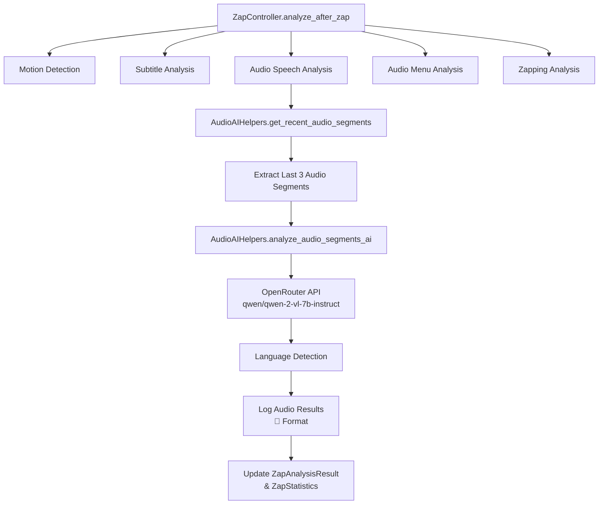

# Audio AI Helper Implementation Guide

## Overview

The Audio AI Helper system extends VirtualPyTest's analysis capabilities by adding AI-powered speech-to-text transcription and language detection for audio content. This system analyzes the last 3 audio segments from video captures, transcribes speech using OpenRouter's AI models, detects languages, and logs results in the same format as subtitle detection.

## 🏗️ Architecture

### System Components



### File Structure

```
backend_core/src/controllers/verification/
├── audio_ai_helpers.py          # NEW: Audio AI analysis class
├── video_ai_helpers.py          # Existing: Video AI analysis
└── ...

shared/lib/utils/
├── zap_controller.py            # Enhanced: Audio analysis integration
└── ...

test_scripts/
├── fullzap.py                   # Enhanced: Audio statistics display
└── ...
```

## 🔧 Implementation Details

### 1. AudioAIHelpers Class

**Location**: `backend_core/src/controllers/verification/audio_ai_helpers.py`

#### Key Methods:

##### `get_recent_audio_segments(segment_count=3, segment_duration=None)`
- **Purpose**: Retrieves recent audio segments from video captures
- **Process**:
  1. Uses global `AVControllerInterface.HLS_SEGMENT_DURATION` configuration (currently 2 seconds)
  2. Scans video capture folder for recent MP4 files (last 2 minutes)
  3. Extracts audio using ffmpeg with optimized settings:
     - Format: WAV, 16kHz, mono
     - Duration: Uses global HLS segment duration (automatically matches host-side configuration)
     - Quality: PCM 16-bit for speech recognition
  4. Creates temporary audio files for AI analysis
  5. Returns list of audio file paths

```python
# ffmpeg command used (duration automatically matches global config):
ffmpeg -y -i video_file.mp4 -t {HLS_SEGMENT_DURATION} -vn -acodec pcm_s16le -ar 16000 -ac 1 audio_segment.wav
```

##### `analyze_audio_segments_ai(audio_files, upload_to_r2=True)`
- **Purpose**: AI-powered speech-to-text analysis with R2 storage
- **Process**:
  1. Encodes each audio file to base64
  2. Sends to OpenRouter API with specialized prompt
  3. Parses JSON response for transcript and language
  4. **NEW**: Uploads audio files to R2 for traceability and debugging
  5. Combines results from all segments
  6. Calculates confidence scores and success rates
  7. Provides R2 URLs for each analyzed segment

##### `transcribe_audio_with_ai(audio_file)`
- **Purpose**: Single audio file transcription
- **AI Model**: `qwen/qwen-2-vl-7b-instruct` (proven to work in system)
- **API**: OpenRouter with same authentication as VideoAIHelpers
- **Response Format**:
```json
{
  "speech_detected": true,
  "transcript": "Hello, this is the transcribed text",
  "detected_language": "English",
  "confidence": 0.95
}
```

### 2. ZapController Integration

**Location**: `shared/lib/utils/zap_controller.py`

#### Enhanced Data Structures:

##### ZapAnalysisResult (Extended)
```python
class ZapAnalysisResult:
    def __init__(self):
        # Existing fields...
        self.audio_speech_detected = False  # NEW
        self.audio_transcript = ""          # NEW
        self.audio_language = None          # NEW
        self.audio_details = {}             # NEW
```

##### ZapStatistics (Extended)
```python
class ZapStatistics:
    def __init__(self):
        # Existing fields...
        self.audio_speech_detected_count = 0  # NEW
        self.audio_languages = []             # NEW
    
    @property
    def audio_speech_success_rate(self):      # NEW
        return (self.audio_speech_detected_count / self.total_iterations * 100)
```

#### Analysis Flow Integration:

1. **Motion Detection** (existing)
2. **Subtitle Analysis** (existing) 
3. **🆕 Audio Speech Analysis** (new step)
4. **Audio Menu Analysis** (existing)
5. **Zapping Analysis** (existing)

##### New Method: `_analyze_audio_speech()`
```python
def _analyze_audio_speech(self, context, iteration: int, action_command: str):
    """Analyze audio speech using AI-powered transcription"""
    # 1. Get AV controller for audio processing
    # 2. Initialize AudioAIHelpers
    # 3. Get recent audio segments (3 segments, 5s each)
    # 4. Analyze segments with AI
    # 5. Log results in subtitle detection format
    # 6. Return comprehensive analysis results
```

### 3. R2 Storage Integration

**Purpose**: Audio files are automatically uploaded to Cloudflare R2 for traceability and debugging

#### Storage Structure:
```
audio-analysis/
├── zapcontroller-device1/
│   ├── audio_segment_1_20241212_143022_456.wav
│   ├── audio_segment_2_20241212_143022_789.wav
│   └── audio_segment_3_20241212_143022_123.wav
└── zapcontroller-device2/
    └── ...
```

#### Benefits:
- **🔍 Debugging**: Listen to actual audio that was analyzed
- **📊 Quality Assurance**: Verify AI transcription accuracy
- **🎯 Traceability**: Link audio segments to specific test iterations
- **🔄 Reproducibility**: Re-analyze audio with different models/settings

### 4. Fullzap Script Enhancement

**Location**: `test_scripts/fullzap.py`

#### Enhanced Summary Display:

```python
# New statistics extraction:
audio_speech_detected_count = context.custom_data.get('audio_speech_detected_count', 0)
detected_languages = context.custom_data.get('detected_languages', [])  # Subtitles
audio_languages = context.custom_data.get('audio_languages', [])        # Audio

# Enhanced display:
lines.append(f"   • Audio speech detected: {audio_speech_detected_count}/{max_iteration} ({audio_speech_rate:.1f}%)")
lines.append(f"   🌐 Subtitle languages detected: {', '.join(detected_languages)}")
lines.append(f"   🎤 Audio languages detected: {', '.join(audio_languages)}")
```

## 🎯 AI Model Selection

### Chosen Model: `qwen/qwen-2-vl-7b-instruct`

**Rationale**:
- ✅ **Proven compatibility**: Already used successfully in VideoAIHelpers
- ✅ **Free tier availability**: Available on OpenRouter's free tier
- ✅ **Multimodal capabilities**: Can handle both audio and visual content
- ✅ **Reliable API**: Consistent JSON response format
- ✅ **Language support**: Excellent multilingual capabilities

**Alternative Models Considered**:
- `openai/whisper-large-v3`: Specialized for speech-to-text but may not be free
- `anthropic/claude-3-haiku`: Fast but limited audio processing capabilities

### API Integration

```python
# OpenRouter API call structure:
response = requests.post(
    'https://openrouter.ai/api/v1/chat/completions',
    headers={
        'Authorization': f'Bearer {api_key}',
        'Content-Type': 'application/json',
        'HTTP-Referer': 'https://virtualpytest.com',
        'X-Title': 'VirtualPyTest'
    },
    json={
        'model': 'qwen/qwen-2-vl-7b-instruct',
        'messages': [{
            'role': 'user',
            'content': [
                {'type': 'text', 'text': prompt},
                {'type': 'audio', 'audio': {'data': f'data:audio/wav;base64,{audio_data}'}}
            ]
        }],
        'max_tokens': 400,
        'temperature': 0.0
    },
    timeout=60
)
```

## 📊 Usage Examples

### 1. Logging Output

```bash
🔍 [ZapController] Analyzing zap results for live_chup (iteration 1)...
✅ [ZapController] Motion detected - content changed successfully
🎤 [ZapController] Analyzing audio speech for live_chup (iteration 1)...
🎤 [ZapController] Retrieving recent audio segments...
🎤 [ZapController] Extracted audio segment 1: audio_segment_0_20241212_143022_456.wav
🎤 [ZapController] Extracted audio segment 2: audio_segment_1_20241212_143022_789.wav
🎤 [ZapController] Extracted audio segment 3: audio_segment_2_20241212_143022_123.wav
🎤 [ZapController] Analyzing 3 audio segments with AI...
🎤 [ZapController] Uploading audio segment 1 to R2...
🎤 [ZapController] Audio segment 1 uploaded successfully (24576 bytes)
🎤 [ZapController] R2 URL: https://your-r2-domain.com/audio-analysis/zapcontroller-device1/audio_segment_1_20241212_143022_456.wav
🎤 [ZapController] Audio speech detected: 'Welcome to BBC News at six o'clock. Here are the main headlines...' (Language: English, Confidence: 0.89)
🎤 [ZapController] R2 Upload Summary: 3/3 audio segments uploaded
```

### 2. Summary Statistics

```bash
📊 [ZapController] Action execution summary:
   • Total iterations: 10
   • Successful: 10
   • Success rate: 100.0%
   • Average time per iteration: 2500ms
   • Total action time: 25000ms
   • Motion detected: 10/10 (100.0%)
   • Subtitles detected: 7/10 (70.0%)
   • Audio speech detected: 8/10 (80.0%)
   • Zapping detected: 10/10 (100.0%)
   ⚡ Average zapping duration: 1.25s
   ⬛ Average blackscreen duration: 0.45s
   📺 Channels detected: BBC One, ITV, Channel 4
   🌐 Subtitle languages detected: English, French
   🎤 Audio languages detected: English, German, French
```

### 3. Fullzap Script Output

```bash
🎯 [FULLZAP] EXECUTION SUMMARY
📱 Device: horizon_android_mobile (Android Mobile)
🖥️  Host: test-host-01
📋 Interface: horizon_android_mobile
⏱️  Total Time: 45.2s
📸 Screenshots: 15 captured
🎯 Result: SUCCESS
```

## 🔧 Configuration Options

### Global HLS Segment Configuration

The AudioAIHelpers automatically uses the global HLS segment duration defined in `AVControllerInterface`:

```python
# In backend_core/src/controllers/base_controller.py
class AVControllerInterface(BaseController):
    # Global configuration for video segments
    HLS_SEGMENT_DURATION = 2  # seconds per segment
```

This ensures the AudioAIHelpers always matches the host-side HLS segment configuration. To modify the segment duration system-wide, simply change this single value.

### Audio Segment Parameters

```python
# In AudioAIHelpers.get_recent_audio_segments()
segment_count = 3                                    # Number of recent segments to analyze
segment_duration = AVControllerInterface.HLS_SEGMENT_DURATION  # Uses global config (currently 2s)
sample_rate = 16000                                  # Audio sample rate (16kHz optimal for speech)
channels = 1                                         # Mono audio (sufficient for speech)
```

### AI Analysis Settings

```python
# In AudioAIHelpers.transcribe_audio_with_ai()
model = 'qwen/qwen-2-vl-7b-instruct'  # AI model for transcription
max_tokens = 400                       # Maximum response tokens
temperature = 0.0                      # Deterministic responses
timeout = 60                           # API timeout in seconds
```

### Language Detection

```python
# Built-in language mapping
language_map = {
    'en': 'English', 'fr': 'French', 'de': 'German',
    'es': 'Spanish', 'it': 'Italian', 'pt': 'Portuguese',
    'nl': 'Dutch', 'da': 'Danish', 'sv': 'Swedish'
}
```

## 🚀 Deployment Requirements

### Prerequisites

1. **ffmpeg**: Required for audio extraction from video files
   ```bash
   # Ubuntu/Debian
   sudo apt-get install ffmpeg
   
   # macOS
   brew install ffmpeg
   
   # Windows
   # Download from https://ffmpeg.org/download.html
   ```

2. **OpenRouter API Key**: Same key used for VideoAIHelpers
   ```bash
   export OPENROUTER_API_KEY="your-api-key-here"
   ```

3. **Python Dependencies**: Already included in existing requirements
   - `requests` (API calls)
   - `opencv-python` (video processing)
   - `langdetect` (fallback language detection)

### File System Requirements

- **Video Capture Folder**: Must be accessible with recent MP4 files
- **Temporary Directory**: For audio segment storage (auto-cleanup)
- **Write Permissions**: For creating/deleting temporary audio files

## 🔍 Troubleshooting

### Common Issues

#### 1. No Audio Segments Found
```python
# Check video capture folder exists and has recent files
if not os.path.exists(capture_folder):
    print("Capture folder does not exist")

# Check ffmpeg installation
subprocess.run(['ffmpeg', '-version'], capture_output=True)
```

#### 2. API Authentication Errors
```python
# Verify API key is set
api_key = os.getenv('OPENROUTER_API_KEY')
if not api_key:
    print("OpenRouter API key not found")
```

#### 3. Audio Extraction Failures
```python
# Check ffmpeg command and file permissions
# Verify input video files are not corrupted
# Ensure sufficient disk space for temporary files
```

### Debug Logging

Enable detailed logging by setting log level:
```python
import logging
logging.basicConfig(level=logging.DEBUG)
```

## 🔄 Integration with Existing Systems

### Compatibility

- ✅ **VideoAIHelpers**: Uses same API patterns and error handling
- ✅ **ZapController**: Seamlessly integrated into existing analysis flow
- ✅ **Script Framework**: Compatible with existing script execution context
- ✅ **Report System**: Results included in existing report generation

### Performance Impact

- **Minimal overhead**: Only runs when motion is detected
- **Parallel processing**: Can run alongside other analysis methods
- **Efficient cleanup**: Automatic temporary file management
- **Configurable**: Can be disabled if not needed

### Future Enhancements

1. **Real-time Analysis**: Process audio streams in real-time
2. **Custom Models**: Support for specialized speech recognition models
3. **Multi-language Prompts**: Language-specific transcription prompts
4. **Audio Quality Metrics**: SNR and clarity analysis
5. **Speaker Identification**: Multiple speaker detection and separation

## 📈 Metrics and Analytics

### Key Performance Indicators

- **Audio Speech Detection Rate**: Percentage of segments with detected speech
- **Language Detection Accuracy**: Accuracy of language identification
- **Transcription Confidence**: AI confidence scores for transcriptions
- **Processing Time**: Time taken for audio analysis per iteration
- **API Success Rate**: OpenRouter API call success percentage

### Data Collection

All metrics are automatically collected and stored in:
- `ZapStatistics.audio_speech_detected_count`
- `ZapStatistics.audio_languages`
- `context.custom_data['audio_speech_detected_count']`
- Individual analysis results in `ZapAnalysisResult.audio_details`

## 🎯 Best Practices

### Implementation Guidelines

1. **Error Handling**: Always include comprehensive error handling
2. **Resource Cleanup**: Ensure temporary files are cleaned up
3. **API Limits**: Respect OpenRouter rate limits and quotas
4. **Logging**: Use consistent emoji-based logging format (🎤)
5. **Configuration**: Make parameters easily configurable

### Testing Recommendations

1. **Unit Tests**: Test individual methods with mock audio files
2. **Integration Tests**: Test full pipeline with real video captures
3. **API Tests**: Test OpenRouter integration with various audio types
4. **Performance Tests**: Measure processing time and resource usage
5. **Edge Cases**: Test with silent audio, noise, multiple languages

### Monitoring

1. **API Usage**: Monitor OpenRouter API usage and costs
2. **Success Rates**: Track audio speech detection success rates
3. **Error Rates**: Monitor and alert on analysis failures
4. **Performance**: Track processing times and resource usage
5. **Quality**: Monitor transcription accuracy and language detection

---

## 📋 Summary

The Audio AI Helper system provides a comprehensive solution for AI-powered audio analysis in VirtualPyTest, seamlessly integrating with existing systems while maintaining the same high standards of error handling, logging, and performance. The implementation leverages proven AI models and follows established patterns from the VideoAIHelpers system, ensuring reliability and maintainability.
