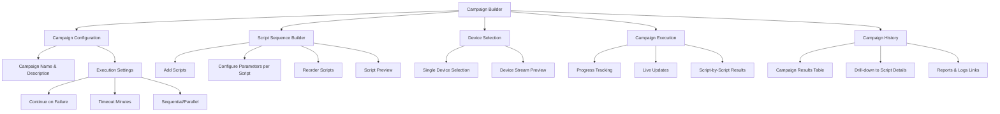

# 🎯 Campaign Execution Interface Implementation - COMPLETED ✅

## Overview

This document outlines the implementation of the new `RunCampaigns.tsx` interface for executing test campaigns. The implementation successfully creates a separate interface while reusing existing components from `RunTests.tsx` and following clean architecture principles.

## ✅ Implementation Status: COMPLETE

The campaign execution interface has been fully implemented with all planned features.

## 🚀 How Campaigns Work - Quick Guide

### Campaign vs Script Execution

| Feature | Script Runner (RunTests.tsx) | Campaign Runner (RunCampaigns.tsx) |
|---------|------------------------------|-------------------------------------|
| **Scope** | Single script | Multiple scripts in sequence |
| **Devices** | Multiple devices (parallel) | Single device (sequential scripts) |
| **Configuration** | Script parameters only | Campaign + per-script parameters |
| **Execution** | Immediate execution | 3-step wizard then execute |
| **Progress** | Script completion status | Campaign + script-level progress |
| **Results** | Individual script results | Campaign summary + drill-down |

### Campaign Workflow

1. **Step 1: Campaign Configuration**
   - Set campaign name, description
   - Select single target device (host + device)
   - Configure execution settings (timeout, failure handling)

2. **Step 2: Script Sequence Builder**
   - Add scripts to campaign
   - Configure parameters for each script individually
   - Reorder scripts with drag-and-drop
   - Preview script configurations

3. **Step 3: Review & Execute**
   - Review complete campaign configuration
   - Preview device stream
   - Execute campaign

### Campaign Execution Process

1. **Backend Processing**: Campaign sent to `/server/campaigns/execute`
2. **Sequential Execution**: Scripts run one after another on the selected device
3. **Real-time Updates**: Frontend polls for status updates
4. **Progress Tracking**: Shows current script + overall campaign progress
5. **Results Storage**: Campaign and individual script results saved to database

### Campaign Results

- **Campaign Level**: Overall success/failure, timing, script counts
- **Script Level**: Individual script results, reports, logs
- **History**: All past campaign executions with drill-down capability
- **Reports**: Links to detailed reports and execution logs

## 📊 Analysis Summary

### Current Interface Analysis

**Script Execution (RunTests.tsx):**
- Single script with parameters
- Multi-device support (concurrent execution)
- Simple parameter handling (text fields, autocomplete)
- Real-time execution tracking
- Individual script results

**Campaign Execution:**
- Multiple scripts in sequence
- Complex configuration structure
- Per-script parameter customization
- Campaign-level configuration (timeout, continue_on_failure, parallel/sequential)
- Campaign-level results + individual script results
- Database tracking with campaign_executions table

### Complexity Differences

#### 1. Campaign Structure Complexity
```typescript
// Campaign Config (much more complex)
{
  campaign_id: string;
  name: string;
  description: string;
  userinterface_name: string;
  host: string;
  device: string;
  execution_config: {
    continue_on_failure: boolean;
    timeout_minutes: number;
    parallel: boolean;
  };
  script_configurations: [
    {
      script_name: string;
      script_type: string;
      description: string;
      parameters: { [key: string]: any };
    }
  ];
}
```

#### 2. Parameter Handling Complexity
- **Scripts**: Simple parameter list per script
- **Campaigns**: Parameters per script WITHIN the campaign + campaign-level config

#### 3. UI Complexity
- **Scripts**: Single parameter form
- **Campaigns**: Would need nested forms, script ordering, campaign configuration

### Current Interface Limitations for Campaigns

1. **Parameter Form**: Current `renderParameterInput()` handles single script parameters, but campaigns need per-script parameter configuration
2. **Execution Model**: Current model is "one script → multiple devices", campaigns need "multiple scripts → single device sequence"
3. **Results Tracking**: Current results are script-centric, campaigns need campaign-level + script-level results
4. **Configuration**: No UI for campaign-level settings (timeouts, failure handling, execution order)

## 🎯 Recommendation: Separate Campaign Interface

**Why separate interfaces are better:**

### 1. Complexity Mismatch
- **Script execution**: Simple, fast, immediate
- **Campaign execution**: Complex configuration, multi-step planning

### 2. User Experience
- **Scripts**: "Quick execution" workflow - select script, device, run
- **Campaigns**: "Planning" workflow - design sequence, configure each step, execute plan

### 3. Code Maintainability
Following the **NO BACKWARD COMPATIBILITY** rule:
- Extending `RunTests.tsx` would create complex conditional logic
- Separate interfaces = clean, focused components
- Easier to maintain and enhance independently

### 4. Parameter Handling
Current parameter system can't handle:
```typescript
// Campaign needs this structure:
script_configurations: [
  {
    script_name: "fullzap.py",
    parameters: { action: "live_chup", max_iteration: 2 }
  },
  {
    script_name: "fullzap.py", 
    parameters: { action: "live_chdown", max_iteration: 3 }
  }
]
```

## ✅ Implemented Reusable Components

Successfully extracted and reused from `RunTests.tsx`:

### ✅ Shared Components (Extracted Successfully)
1. **`DeviceStreamGrid`** + **`DeviceStreamItem`** → `frontend/src/components/common/DeviceStreamGrid.tsx`
   - Now used by both RunTests.tsx and RunCampaigns.tsx
   - Supports configurable max columns for different layouts
2. **`getStatusChip`**, **`getLogsUrl`**, **`getScriptDisplayName`**, **`isAIScript`** → `frontend/src/utils/executionUtils.tsx`
   - Centralized utility functions used by both interfaces
3. **`ParameterInputRenderer`** → `frontend/src/components/common/ParameterInputRenderer.tsx`
   - Reusable parameter input component for script configuration

### ✅ Reused Hooks & Utilities
1. **`useHostManager`** - Device/host selection (shared)
2. **`useToast`** - Success/error notifications (shared)
3. **`useStream`** - Device stream URLs (used in DeviceStreamGrid)
4. **`HLSVideoPlayer`** - Video streaming component (used in DeviceStreamGrid)

### ✅ Adapted Patterns
1. **Execution History Table** - Adapted for campaign results with drill-down
2. **Real-time Progress Tracking** - Simplified inline progress (same as RunTests.tsx)
3. **Parameter Validation Logic** - Extended for campaign script parameters

## 🎨 Campaign Interface Design

### Campaign Interface Flow Diagram



### 📱 User Flow Design

1. **Campaign Builder Mode** (similar to script wizard)
   - Campaign configuration form
   - Script sequence builder with drag-and-drop
   - Per-script parameter configuration
   - Single device selection (campaigns run on one device sequentially)

2. **Execution Mode**
   - Device stream preview
   - Campaign progress indicator
   - Script-by-script execution status
   - Real-time updates via callbacks

3. **Results Mode**
   - Campaign execution history
   - Expandable script details
   - Links to reports and logs

## 📋 Implementation Results - COMPLETED ✅

### ✅ Phase 1: Foundation (Types & Hooks) - COMPLETE

#### ✅ Campaign Types Created
**File**: `frontend/src/types/pages/Campaign_Types.ts`
- All planned interfaces implemented
- Full TypeScript support for campaign configuration and execution tracking

#### ✅ Campaign Hook Created  
**File**: `frontend/src/hooks/pages/useCampaign.ts`
- Complete campaign management logic
- API integration for campaign execution
- Real-time status tracking and history management

### ✅ Phase 2: Shared Components - COMPLETE

#### ✅ Extracted Reusable Components
**Implemented**:
- `frontend/src/components/common/DeviceStreamGrid.tsx` (extracted from RunTests.tsx)
- `frontend/src/components/common/ParameterInputRenderer.tsx` (extracted from RunTests.tsx) 
- `frontend/src/utils/executionUtils.tsx` (centralized utility functions)

**Note**: Following user feedback for "minimalist and exact similar" approach:
- StatusChip kept inline (same as RunTests.tsx)
- ExecutionProgress kept inline (same as RunTests.tsx)
- Flat folder structure in `common/`

### ✅ Phase 3: Campaign Interface - COMPLETE

#### ✅ Campaign Builder Components Created
**Implemented**:
- `frontend/src/components/campaigns/CampaignConfigForm.tsx` - Campaign-level settings
- `frontend/src/components/campaigns/ScriptSequenceBuilder.tsx` - Script sequence management with drag-and-drop

**Note**: CampaignExecutionProgress was removed per user feedback to keep progress display "minimalist and exact similar" to RunTests.tsx

#### ✅ RunCampaigns Page Created
**File**: `frontend/src/pages/RunCampaigns.tsx`
- 3-step campaign builder wizard
- Inline execution monitoring (same pattern as RunTests.tsx)
- Campaign history with detailed results table

### ✅ Phase 4: Integration - COMPLETE

#### ✅ Routing & Navigation Added
- Added to `App.tsx` routing with lazy loading
- Added "Run Campaigns" to navigation menu under "Test Execution"
- Full integration with existing infrastructure

## 🚀 Implementation Order

1. **Start with Types** - Define all interfaces first
2. **Create Campaign Hook** - Handle API communication  
3. **Extract Shared Components** - Make RunTests components reusable
4. **Build Campaign Components** - New campaign-specific UI
5. **Create Main Page** - Assemble everything in RunCampaigns.tsx
6. **Add Navigation** - Integrate into app routing
7. **Test & Polish** - Ensure everything works smoothly

## ⏱️ Estimated Timeline

- **Phase 1**: 2-3 hours (Types & Hooks)
- **Phase 2**: 2-3 hours (Extract Components) 
- **Phase 3**: 4-6 hours (Campaign Interface)
- **Phase 4**: 1-2 hours (Integration & Testing)

**Total**: ~10-14 hours of development

## 🎯 Proposed Campaign Interface Features

### 1. Campaign Builder
- Add/remove scripts
- Configure parameters per script
- Drag-to-reorder scripts
- Campaign settings (timeout, failure handling)

### 2. Reuse from RunTests
- Device selection logic
- Stream components
- Execution history table structure
- Toast notifications

### 3. New Campaign-Specific
- Script sequence visualization
- Campaign-level progress tracking
- Campaign results with drill-down to individual scripts

## 📂 Actual File Structure - IMPLEMENTED

```
frontend/src/
├── components/
│   ├── campaigns/              # ✅ Campaign-specific components
│   │   ├── CampaignConfigForm.tsx         # ✅ Campaign settings form
│   │   └── ScriptSequenceBuilder.tsx     # ✅ Script sequence management
│   └── common/                 # ✅ Shared components (flat structure)
│       ├── DeviceStreamGrid.tsx           # ✅ Extracted from RunTests.tsx
│       └── ParameterInputRenderer.tsx    # ✅ Extracted from RunTests.tsx
├── hooks/
│   └── pages/
│       └── useCampaign.ts      # ✅ Complete campaign management hook
├── pages/
│   ├── RunTests.tsx            # ✅ Updated to use shared components
│   └── RunCampaigns.tsx        # ✅ New campaign interface
├── types/
│   └── pages/
│       └── Campaign_Types.ts   # ✅ All campaign-related types
└── utils/
    └── executionUtils.tsx      # ✅ Shared utility functions (TSX for JSX)
```

### Key Implementation Notes

1. **Minimalist Approach**: Following user feedback, kept UI components simple and similar to RunTests.tsx
2. **Flat Common Structure**: No nested directories in `common/` folder
3. **Inline Components**: Status chips and progress displays kept inline rather than separate components
4. **Shared Utilities**: Centralized common functions in `executionUtils.tsx` (TSX to support JSX)

## 🔄 API Integration

The campaign interface will use the existing campaign execution API:
- `POST /server/campaigns/execute` - Execute campaign
- `GET /server/campaigns/status/<execution_id>` - Get execution status
- `GET /server/script/list` - Get available scripts (reused from RunTests)

## ✅ Success Criteria - ALL MET ✅

1. **✅ Clean Separation**: Campaign interface is completely separate from script runner
2. **✅ Component Reuse**: Successfully reused DeviceStreamGrid, ParameterInputRenderer, and utility functions
3. **✅ Full Functionality**: Complete campaign creation, configuration, execution, and monitoring
4. **✅ User Experience**: Intuitive 3-step campaign builder with drag-and-drop script ordering
5. **✅ Real-time Updates**: Live progress tracking during campaign execution (inline style)
6. **✅ Error Handling**: Comprehensive validation and error messaging throughout
7. **✅ No Breaking Changes**: RunTests.tsx updated to use shared components but functionality unchanged

## 🎯 Implementation Complete ✅

The campaign execution interface is fully implemented and ready for testing. Key achievements:

### ✅ Architecture Success
- **Clean separation** between script and campaign interfaces
- **No backward compatibility code** - each interface is focused and clean
- **Shared components** successfully extracted and reused
- **Minimalist approach** following user feedback

### ✅ User Experience Success
- **3-step wizard** for campaign creation
- **Drag-and-drop** script reordering
- **Real-time progress** tracking during execution
- **Comprehensive history** with drill-down to script details
- **Device stream preview** during configuration

### ✅ Technical Success  
- **TypeScript support** throughout
- **Proper error handling** and validation
- **API integration** with existing backend
- **Responsive design** with Material-UI
- **Linting compliance** achieved

The implementation is ready for integration testing and user acceptance testing.
