<table>
  <tr>
    <td align="center" width="250">
      <b>Dashboard</b>
      <a href="../../frontend/public/screenshot/dashboard.png" target="_blank">
        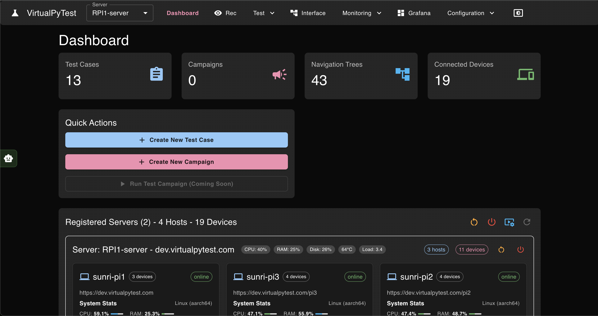
      </a>
    </td>
    <td align="center" width="250">
      <b>Device Control</b>
      <a href="../../frontend/public/screenshot/rec.png" target="_blank">
        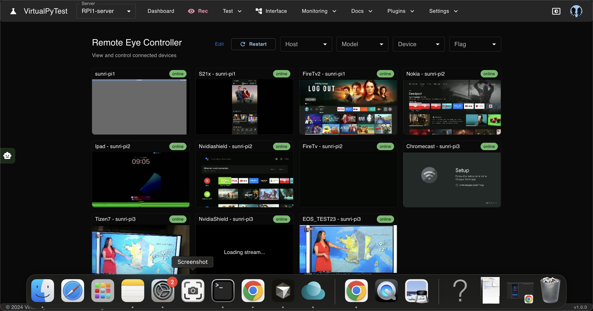
      </a>
    </td>
    <td align="center" width="250">
      <b>Mobile Dump</b>
      <a href="../../frontend/public/screenshot/rec_mobile_dump.png" target="_blank">
        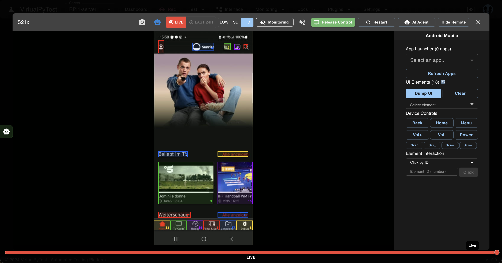
      </a>
    </td>
  </tr>
  <tr>
    <td align="center" width="250">
      <b>Test Execution</b>
      <a href="../../frontend/public/screenshot/testcase_runner.png" target="_blank">
        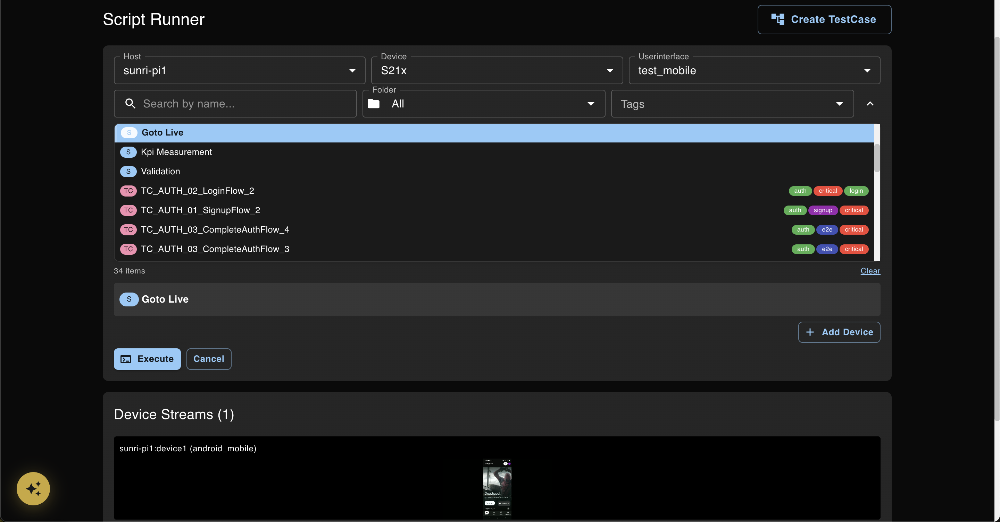
      </a>
    </td>
    <td align="center" width="250">
      <b>Navigation Tree</b>
      <a href="../../frontend/public/screenshot/navigation_tree_1.png" target="_blank">
        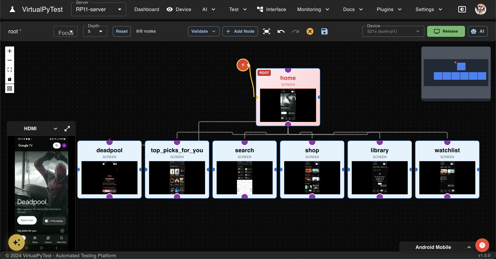
      </a>
    </td>
    <td align="center" width="250">
      <b>Navigation Subtree</b>
      <a href="../../frontend/public/screenshot/navigation_subtree.png" target="_blank">
        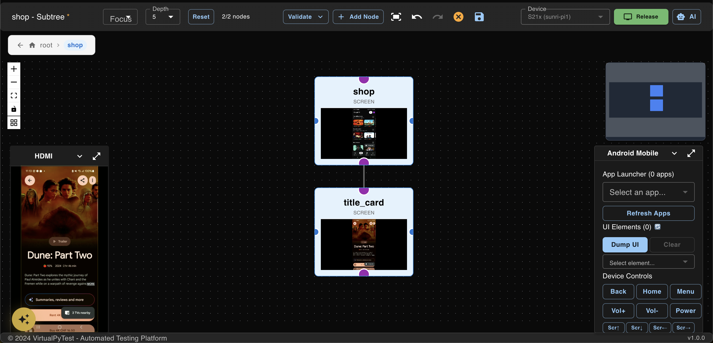
      </a>
    </td>
  </tr>
  <tr>
    <td align="center" width="250">
      <b>Navigation Metrics</b>
      <a href="../../frontend/public/screenshot/navigation_node_metric.png" target="_blank">
        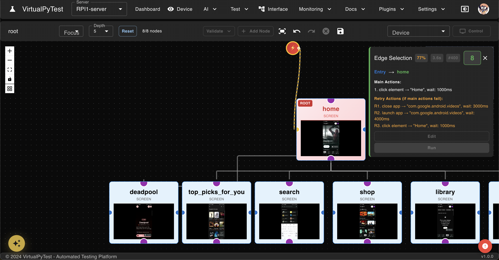
      </a>
    </td>
    <td align="center" width="250">
      <b>Navigation Node</b>
      <a href="../../frontend/public/screenshot/node_verification.png" target="_blank">
        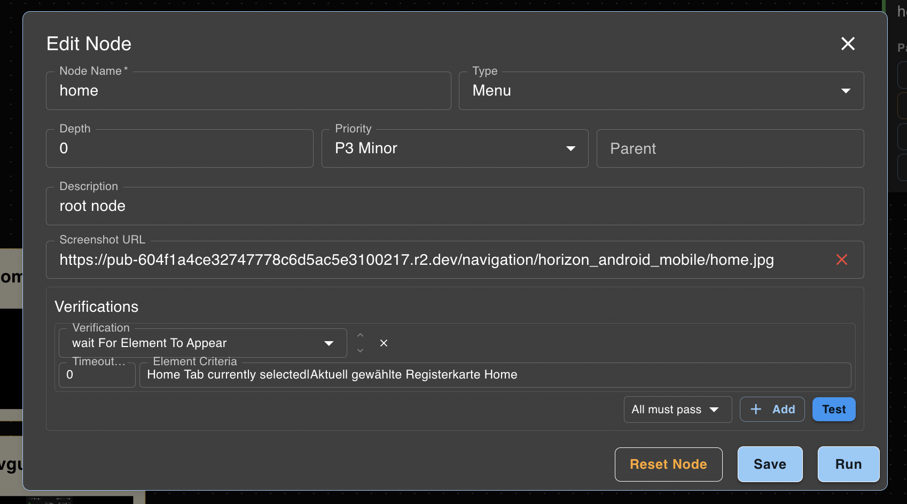
      </a>
    </td>
    <td align="center" width="250">
      <b>Navigation Edge</b>
      <a href="../../frontend/public/screenshot/edge_action.png" target="_blank">
        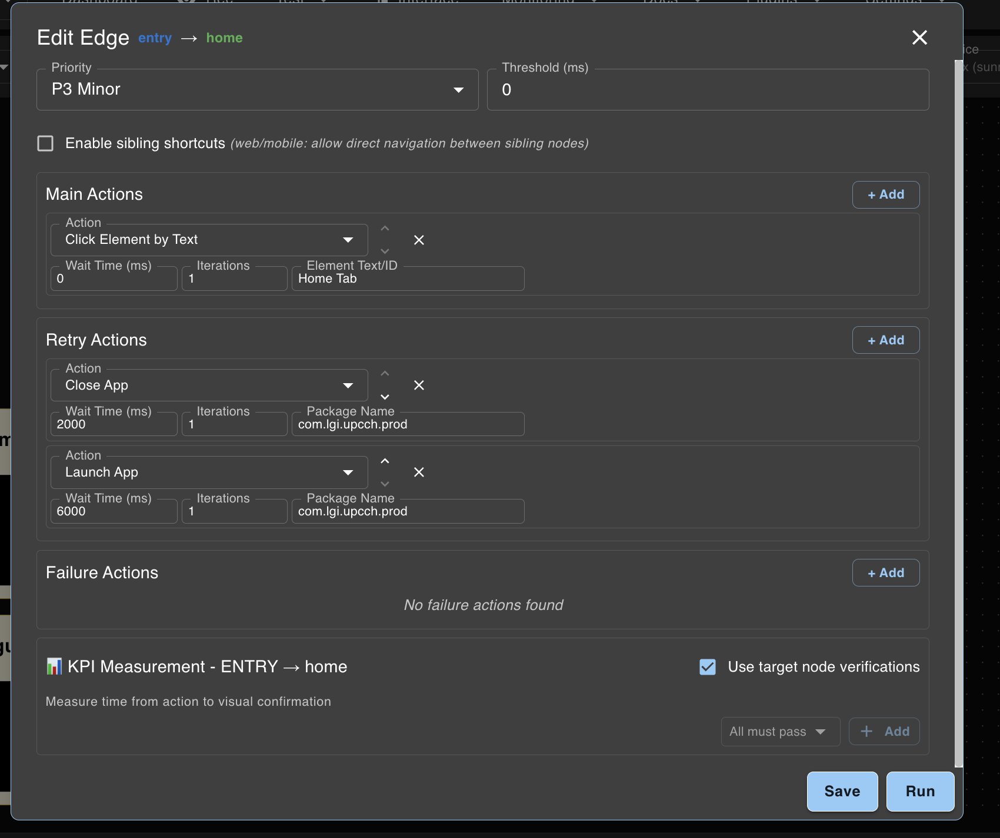
      </a>
    </td>
  </tr>
  <tr>
    <td align="center" width="250">
      <b>Pathfinding Preview</b>
      <a href="../../frontend/public/screenshot/pathfinding_preview.png" target="_blank">
        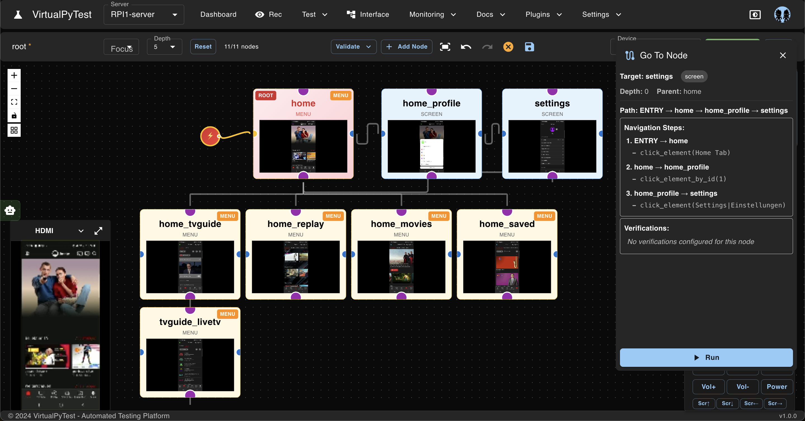
      </a>
    </td>
    <td align="center" width="250">
      <b>Verification Editor</b>
      <a href="../../frontend/public/screenshot/verification_editor_1.png" target="_blank">
        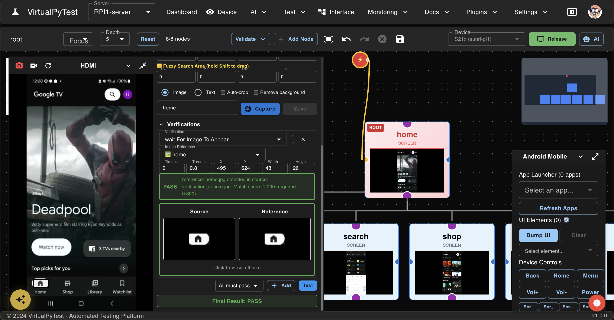
      </a>
    </td>
    <td align="center" width="250">
      <b>Verification Image</b>
      <a href="../../frontend/public/screenshot/verification_editor_2.png" target="_blank">
        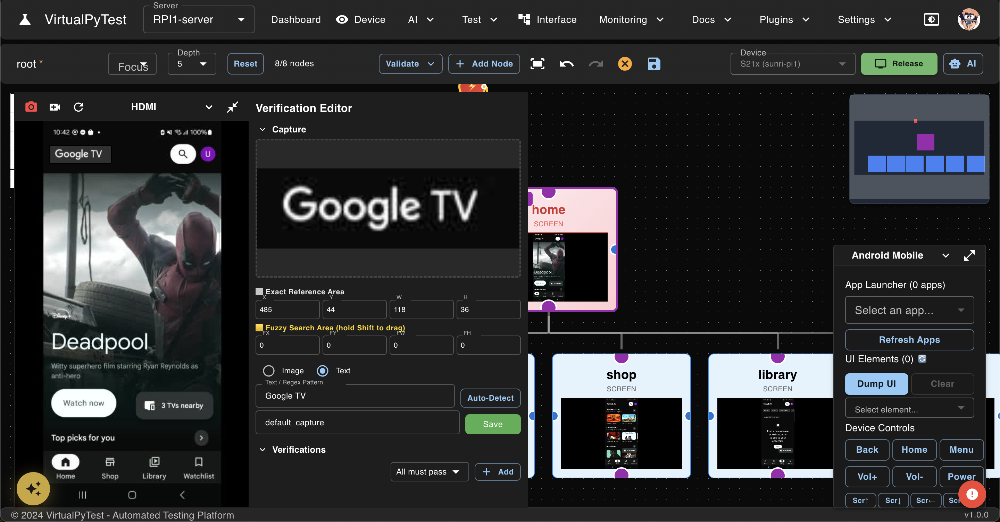
      </a>
    </td>
  </tr>
  <tr>
    <td align="center" width="250">
      <b>Verification Text</b>
      
    </td>
    <td align="center" width="250">
      <b>TestCase Builder</b>
      <a href="../../frontend/public/screenshot/testcase_builder.png" target="_blank">
        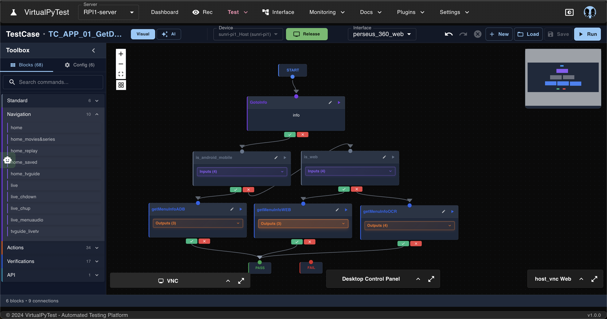
      </a>
    </td>
    <td align="center" width="250">
      <b>TestCase Runner</b>
      
    </td>
  </tr>
  <tr>
    <td align="center" width="250">
      <b>TestCase Deployment</b>
      <a href="../../frontend/public/screenshot/deployments.png" target="_blank">
        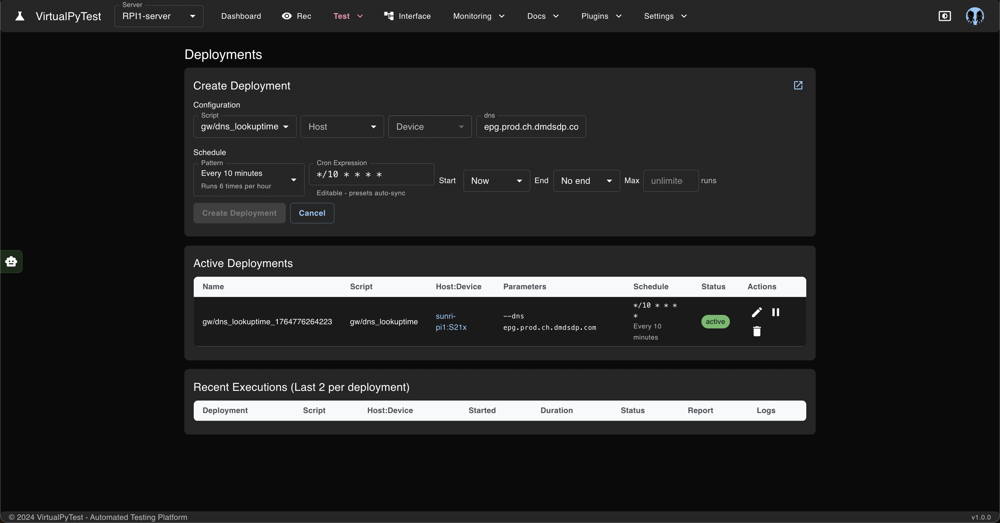
      </a>
    </td>
    <td align="center" width="250">
      <b>Test Report</b>
      <a href="../../frontend/public/screenshot/test_reports.png" target="_blank">
        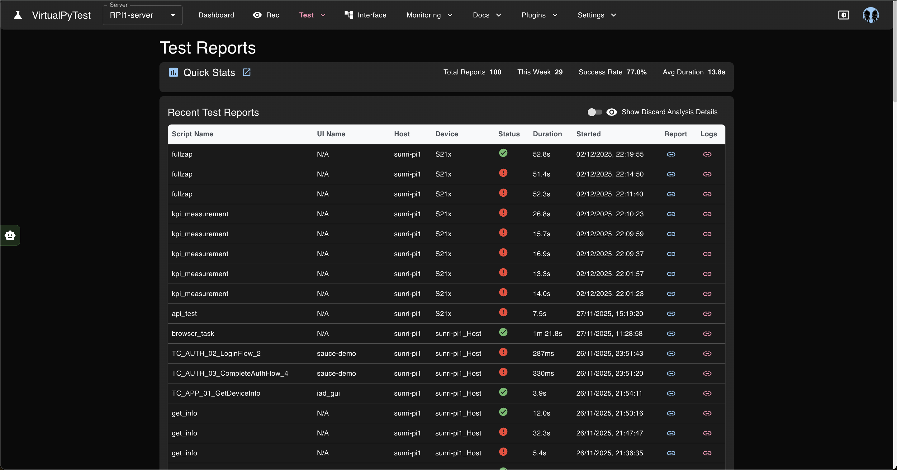
      </a>
    </td>
    <td align="center" width="250">
      <b>Test Report - Detail</b>
      <a href="../../frontend/public/screenshot/test_report_2.png" target="_blank">
        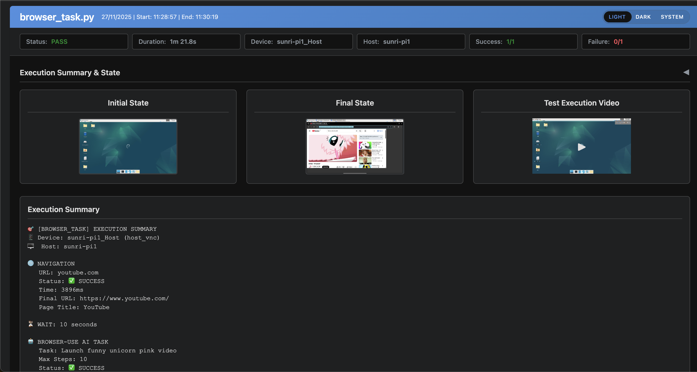
      </a>
    </td>
  </tr>
  <tr>
    <td align="center" width="250">
      <b>Test Report</b>
      
    </td>
    <td align="center" width="250">
      <b>Zap Detection</b>
      
    </td>
    <td align="center" width="250">
      <b>Grafana Integration</b>
      <a href="../../frontend/public/screenshot/grafana_iframe.png" target="_blank">
        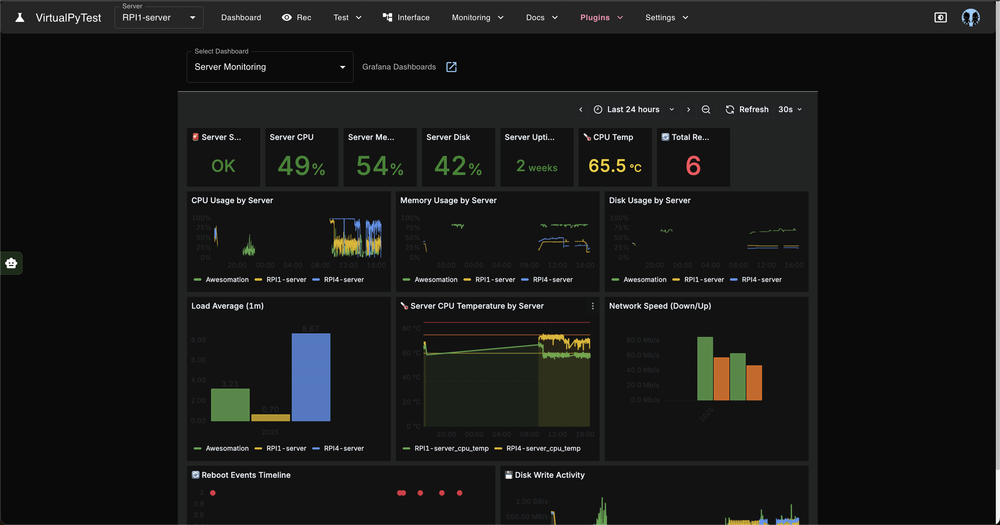
      </a>
    </td>
  </tr>
  <tr>
    <td align="center" width="250">
      <b>Grafana Dashboard</b>
      <a href="../../frontend/public/screenshot/grafana_scripts.png" target="_blank">
        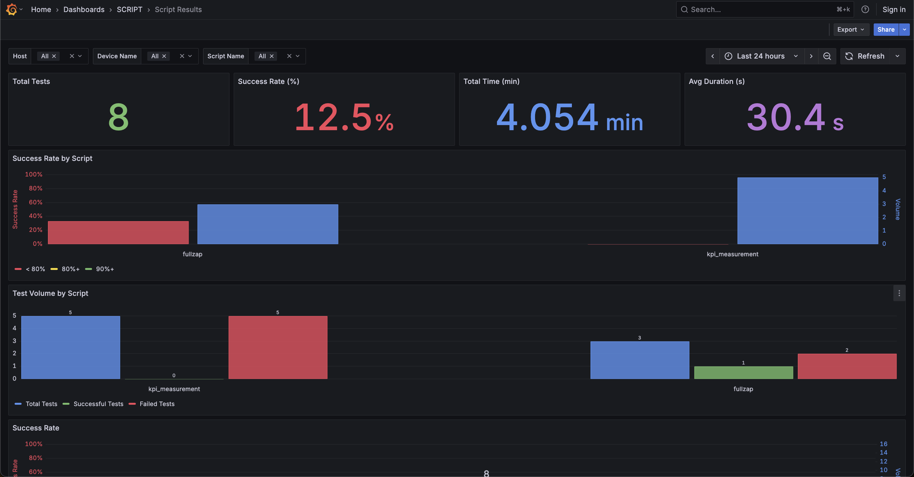
      </a>
    </td>
    <td align="center" width="250">
      <b>Grafana Radar</b>
      <a href="../../frontend/public/screenshot/grafana_kpi_radar.png" target="_blank">
        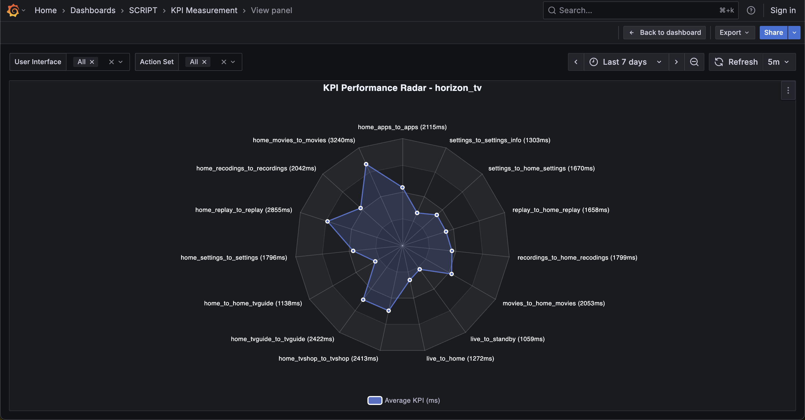
      </a>
    </td>
    <td align="center" width="250">
      <b>Live Monitoring</b>
      <a href="../../frontend/public/screenshot/monitoring_1.png" target="_blank">
        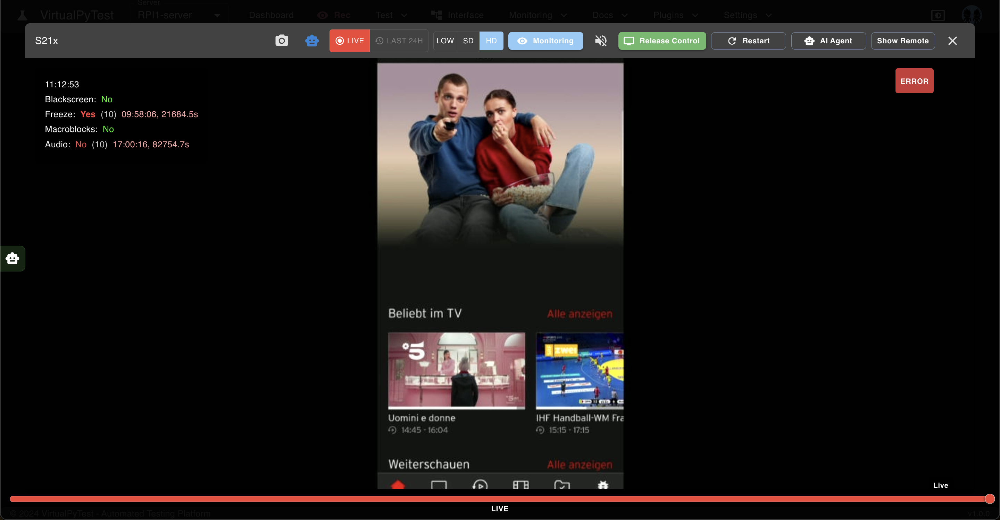
      </a>
    </td>
  </tr>
  <tr>
    <td align="center" width="250">
      <b>Heatmap</b>
      <a href="../../frontend/public/screenshot/heatmap_1.png" target="_blank">
        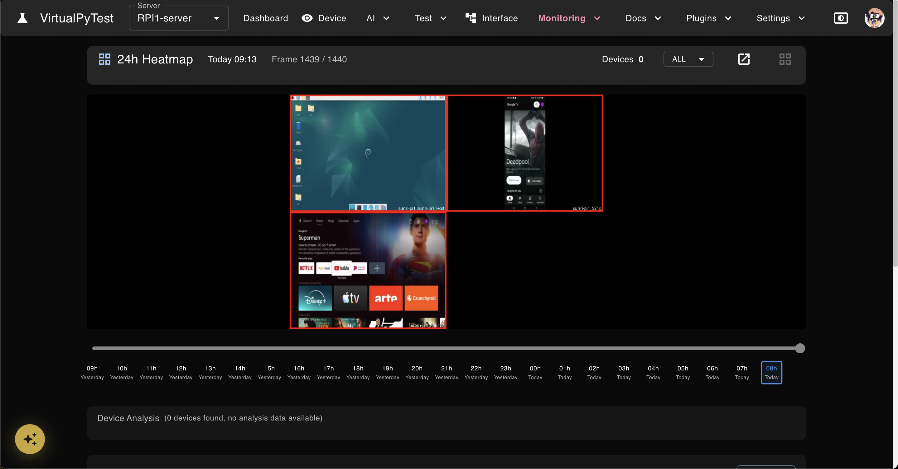
      </a>
    </td>
    <td align="center" width="250">
      <b>Heatmap Details</b>
      <a href="../../frontend/public/screenshot/heatmap_2.png" target="_blank">
        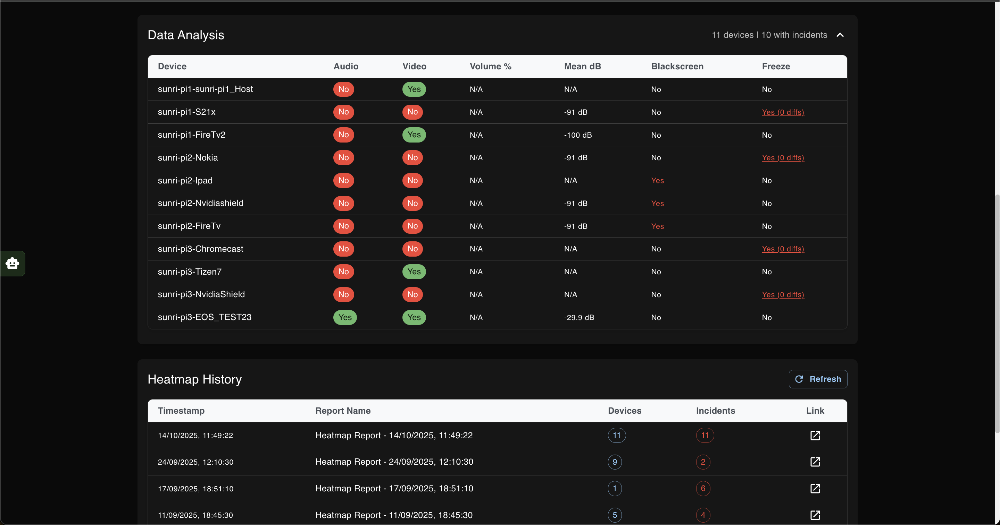
      </a>
    </td>
    <td align="center" width="250">
      <b>Heatmap Report</b>
      <a href="../../frontend/public/screenshot/heatmap_report.png" target="_blank">
        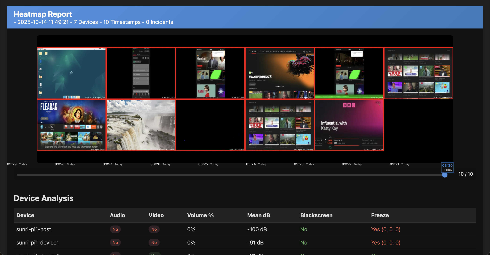
      </a>
    </td>
  </tr>
  <tr>
    <td align="center" width="250">
      <b>Incidents Open</b>
      <a href="../../frontend/public/screenshot/alerts_incidents_open.png" target="_blank">
        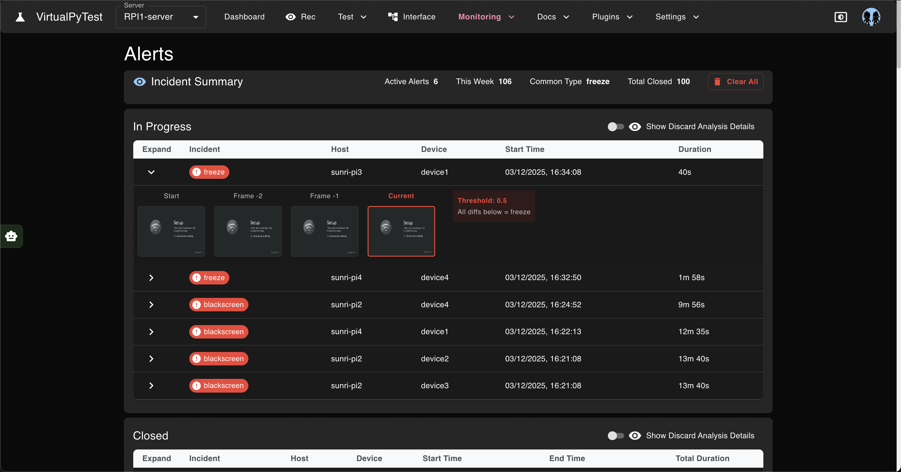
      </a>
    </td>
    <td align="center" width="250">
      <b>Incidents Close</b>
      
    </td>
    <td align="center" width="250">
      <b>API Testing</b>
      <a href="../../frontend/public/screenshot/api_testing_1.png" target="_blank">
        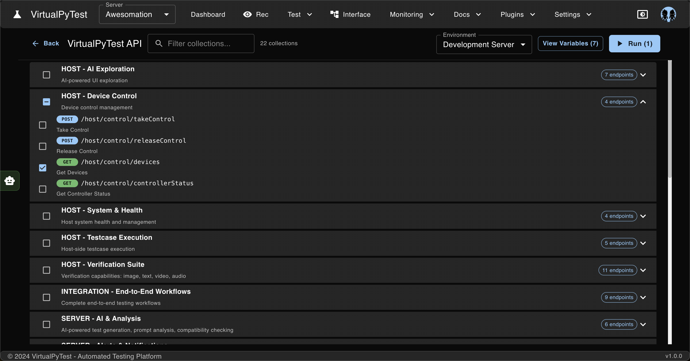
      </a>
    </td>
  </tr>
  <tr>
    <td align="center" width="250">
      <b>API Run</b>
      <a href="../../frontend/public/screenshot/api_testing_2.png" target="_blank">
        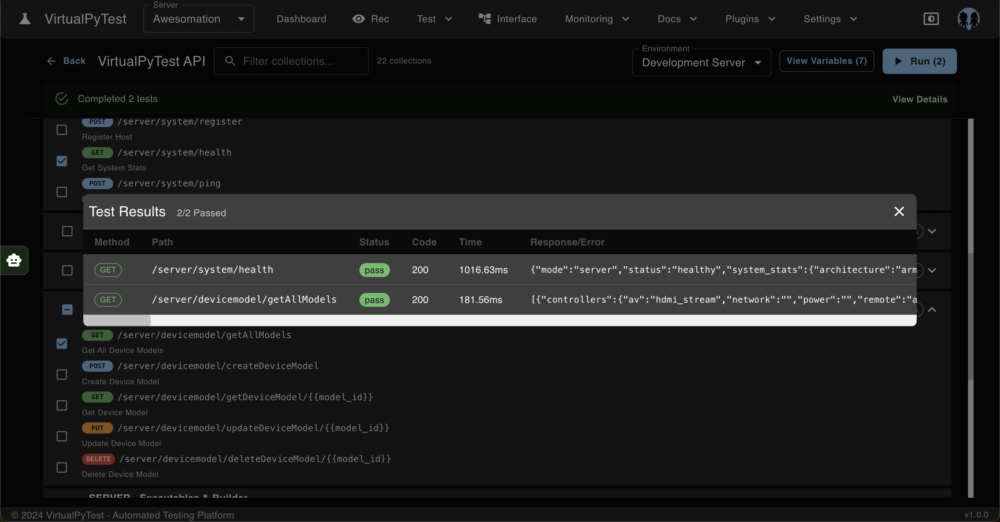
      </a>
    </td>
    <td align="center" width="250">
      <b>Postman Integration</b>
      <a href="../../frontend/public/screenshot/postman.png" target="_blank">
        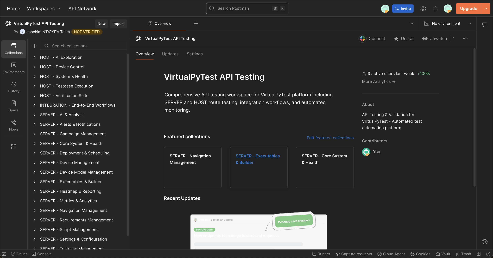
      </a>
    </td>
    <td align="center" width="250">
      <b>Dependency Script Node</b>
      <a href="../../frontend/public/screenshot/dependency_report_1.png" target="_blank">
        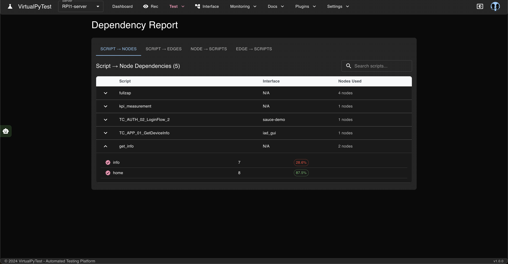
      </a>
    </td>
  </tr>
  <tr>
    <td align="center" width="250">
      <b>Dependency Node Script</b>
      
    </td>
    <td align="center" width="250">
      <b>Ask AI</b>
      <a href="../../frontend/public/screenshot/ask_ai.png" target="_blank">
        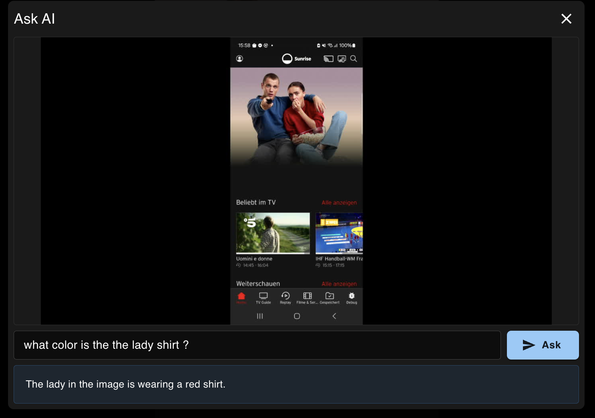
      </a>
    </td>
    <td align="center" width="250">
     <b>AI Model Generation</b>
      <a href="../../frontend/public/screenshot/ai_model1.png" target="_blank">
        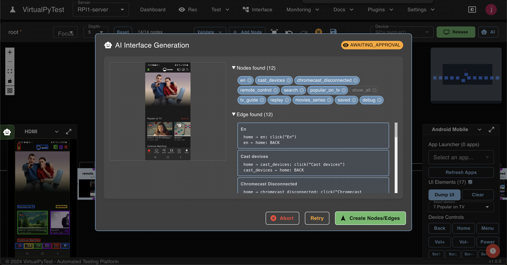
      </a>
    </td>
    </td>
  </tr>
  <tr>
    <td align="center" width="250">
      <b>AI Model Progression</b>
      <a href="../../frontend/public/screenshot/ai_model2.png" target="_blank">
        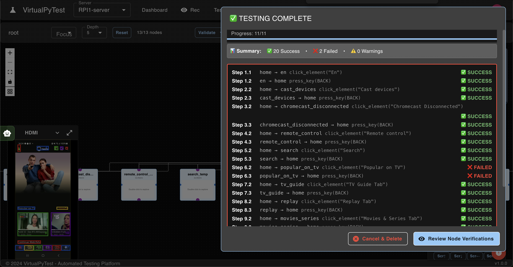
      </a>
    </td>
    <td align="center" width="250">
      <b>AI Model Review</b>
      <a href="../../frontend/public/screenshot/ai_model3.png" target="_blank">
        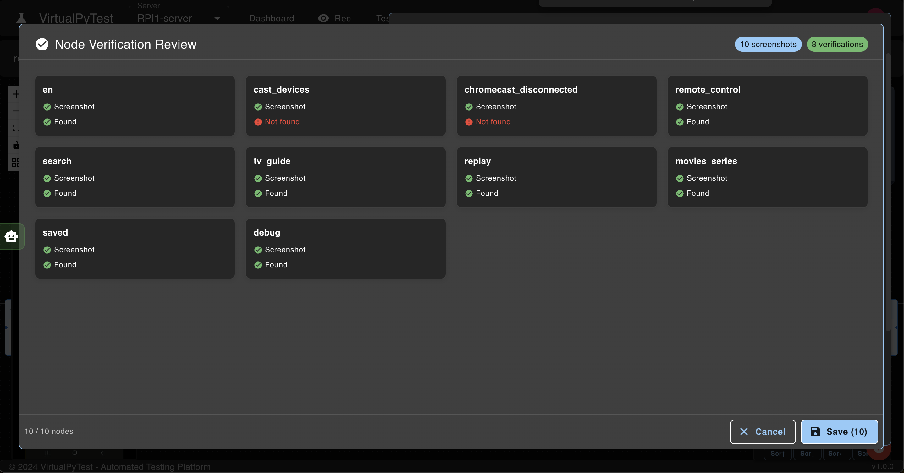
      </a>
    </td>
    <td align="center" width="250">
     <b>AI Node Verification</b>
      <a href="../../frontend/public/screenshot/ai_model4.png" target="_blank">
        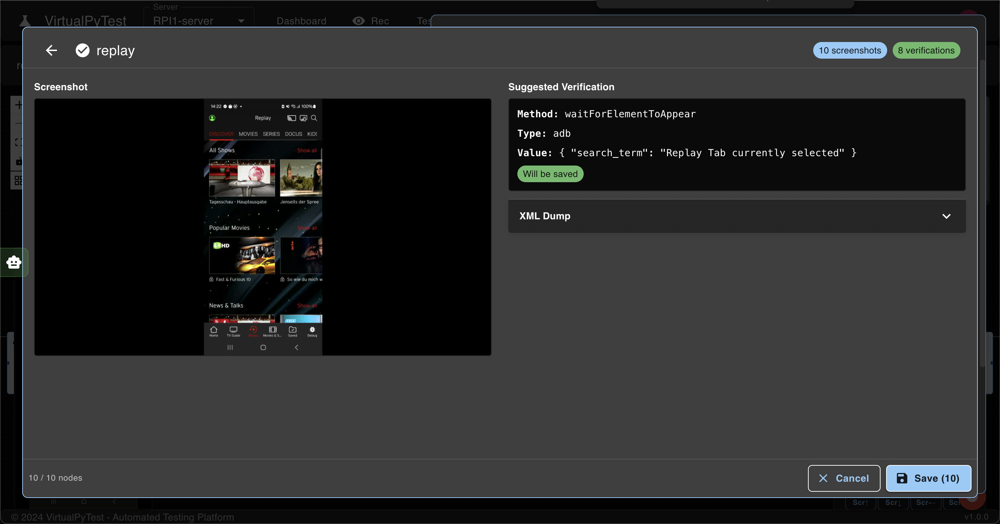
      </a>
    </td>
  </tr>
</table>