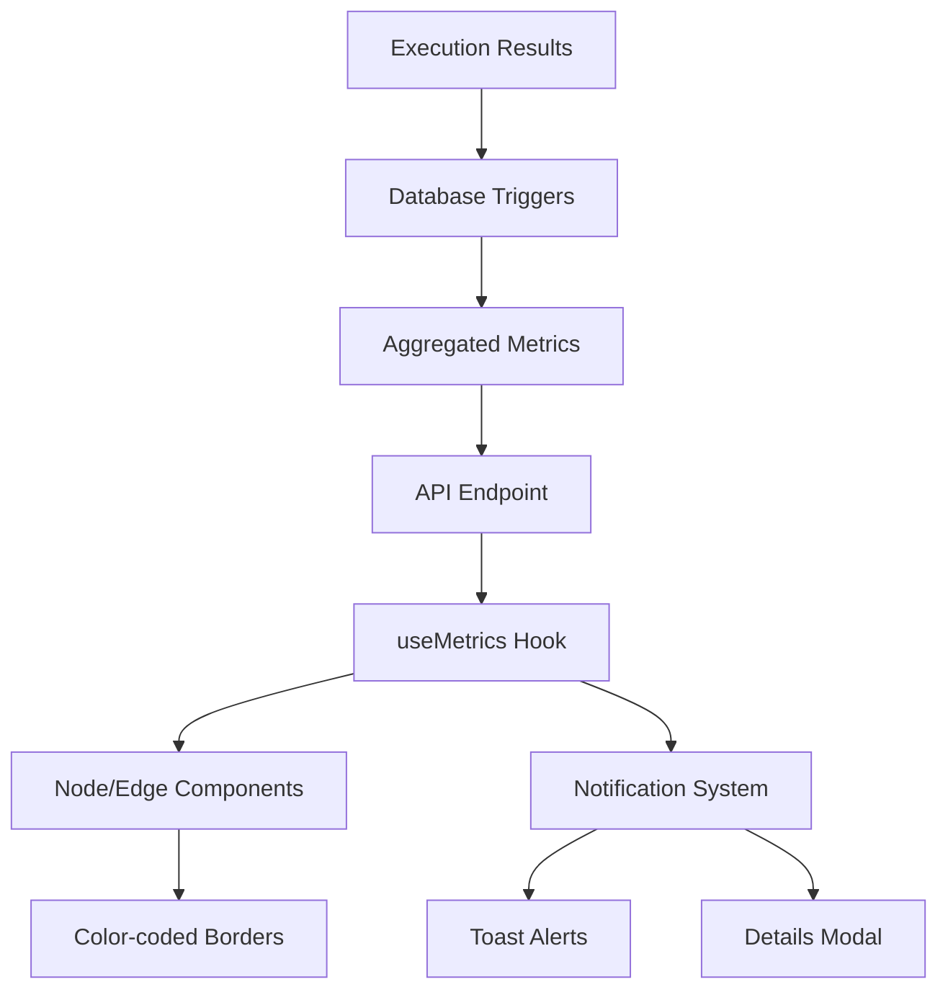

# Navigation Node & Edge Metrics System

## 🎯 Overview

The Navigation Metrics System provides **database-driven confidence visualization** for navigation trees based on execution volume and success rates. It displays real-time confidence levels through color-coded borders and provides notifications when confidence drops below acceptable thresholds.

## 📊 Architecture

### Database Layer

#### Metrics Tables
```sql
-- Node execution metrics (aggregated automatically via triggers)
CREATE TABLE node_metrics (
  id uuid PRIMARY KEY DEFAULT uuid_generate_v4(),
  node_id varchar NOT NULL,
  tree_id uuid,
  team_id uuid NOT NULL,
  total_executions integer DEFAULT 0,
  successful_executions integer DEFAULT 0,
  success_rate numeric DEFAULT 0,
  avg_execution_time_ms integer DEFAULT 0,
  created_at timestamp with time zone DEFAULT now(),
  UNIQUE(node_id, tree_id, team_id)
);

-- Edge execution metrics (aggregated automatically via triggers)  
CREATE TABLE edge_metrics (
  id uuid PRIMARY KEY DEFAULT uuid_generate_v4(),
  edge_id varchar NOT NULL,
  tree_id uuid,
  team_id uuid NOT NULL,
  total_executions integer DEFAULT 0,
  successful_executions integer DEFAULT 0,
  success_rate numeric DEFAULT 0,
  avg_execution_time_ms integer DEFAULT 0,
  created_at timestamp with time zone DEFAULT now(),
  UNIQUE(edge_id, tree_id, team_id)
);

-- Raw execution data (source of truth)
CREATE TABLE execution_results (
  id uuid PRIMARY KEY DEFAULT gen_random_uuid(),
  team_id varchar NOT NULL,
  tree_id varchar NOT NULL,
  node_id varchar,           -- For verification executions
  edge_id varchar,           -- For action executions
  execution_type varchar NOT NULL, -- 'verification' | 'action'
  host_name varchar NOT NULL,
  success boolean NOT NULL,
  execution_time_ms integer NOT NULL,
  message text,
  error_details jsonb,
  executed_at timestamp DEFAULT NOW()
);
```

#### Automatic Aggregation Trigger
```sql
-- Trigger function that updates metrics on every execution
CREATE OR REPLACE FUNCTION update_metrics() RETURNS TRIGGER AS $$
BEGIN
  -- Update node_metrics for verification executions
  IF NEW.execution_type = 'verification' AND NEW.node_id IS NOT NULL THEN
    INSERT INTO node_metrics (node_id, tree_id, team_id, total_executions, successful_executions, success_rate, avg_execution_time_ms)
    VALUES (NEW.node_id, NEW.tree_id, NEW.team_id, 1, CASE WHEN NEW.success THEN 1 ELSE 0 END, 
            CASE WHEN NEW.success THEN 1.0 ELSE 0.0 END, COALESCE(NEW.execution_time_ms, 0))
    ON CONFLICT (node_id, tree_id, team_id) DO UPDATE SET
      total_executions = node_metrics.total_executions + 1,
      successful_executions = node_metrics.successful_executions + CASE WHEN NEW.success THEN 1 ELSE 0 END,
      success_rate = (node_metrics.successful_executions + CASE WHEN NEW.success THEN 1 ELSE 0 END)::decimal / (node_metrics.total_executions + 1),
      avg_execution_time_ms = ((node_metrics.avg_execution_time_ms * node_metrics.total_executions) + COALESCE(NEW.execution_time_ms, 0)) / (node_metrics.total_executions + 1);
  END IF;
  
  -- Update edge_metrics for action executions  
  IF NEW.execution_type = 'action' AND NEW.edge_id IS NOT NULL THEN
    INSERT INTO edge_metrics (edge_id, tree_id, team_id, total_executions, successful_executions, success_rate, avg_execution_time_ms)
    VALUES (NEW.edge_id, NEW.tree_id, NEW.team_id, 1, CASE WHEN NEW.success THEN 1 ELSE 0 END,
            CASE WHEN NEW.success THEN 1.0 ELSE 0.0 END, COALESCE(NEW.execution_time_ms, 0))
    ON CONFLICT (edge_id, tree_id, team_id) DO UPDATE SET
      total_executions = edge_metrics.total_executions + 1,
      successful_executions = edge_metrics.successful_executions + CASE WHEN NEW.success THEN 1 ELSE 0 END,
      success_rate = (edge_metrics.successful_executions + CASE WHEN NEW.success THEN 1 ELSE 0 END)::decimal / (edge_metrics.total_executions + 1),
      avg_execution_time_ms = ((edge_metrics.avg_execution_time_ms * edge_metrics.total_executions) + COALESCE(NEW.execution_time_ms, 0)) / (edge_metrics.total_executions + 1);
  END IF;
  
  RETURN NEW;
END;
$$ LANGUAGE plpgsql;

-- Attach trigger to execution_results table
CREATE TRIGGER metrics_trigger
  AFTER INSERT ON execution_results
  FOR EACH ROW EXECUTE FUNCTION update_metrics();
```

### Backend API

#### Metrics Endpoint
```typescript
// GET /server/metrics/tree/:treeId
interface MetricsApiResponse {
  success: boolean;
  error?: string;
  tree_metrics: TreeMetrics;
  node_metrics: RawNodeMetrics[];
  edge_metrics: RawEdgeMetrics[];
}
```

### Frontend Architecture

#### Core Components

1. **`useMetrics` Hook** - Fetches and manages metrics data
2. **`MetricsNotification`** - Toast notifications for confidence warnings
3. **`MetricsModal`** - Detailed view of low confidence items
4. **Enhanced Validation Colors** - Confidence-based visual feedback

#### Data Flow



## 🎨 Visual System

### Confidence Levels & Colors

| Confidence | Level | Border Color | Edge Color | Description |
|------------|-------|--------------|------------|-------------|
| ≥95% | High | `#4caf50` (Green) | `#4caf50` (Green) | Excellent confidence |
| 90-95% | Medium | `#ff9800` (Orange) | `#ff9800` (Orange) | Good confidence |
| <90% | Low | `#f44336` (Red) | `#f44336` (Red) | Needs attention |
| No data | Untested | `#9e9e9e` (Gray) | `#9e9e9e` (Gray) | No metrics available |

### Confidence Calculation

```typescript
const calculateConfidence = (totalExecutions: number, successRate: number): number => {
  // Volume weight: reaches 1.0 at 10 executions, caps at 1.0
  const volumeWeight = Math.min(totalExecutions / 10, 1.0);
  
  // Success rate weight: direct mapping 0.0-1.0
  const successWeight = successRate;
  
  // Combined confidence: 30% volume importance, 70% success importance
  return (volumeWeight * 0.3) + (successWeight * 0.7);
};
```

### Notification System

#### Toast Notifications (Minimalist Design)
- **Position**: Bottom-right corner
- **Duration**: 6 seconds auto-hide
- **Error (Red)**: Global confidence <90%
- **Warning (Orange)**: Global confidence 90-95%
- **No notification**: Global confidence ≥95%
- **Interaction**: Click to view details modal (toast disappears immediately)
- **Skip Option**: Small close icon to dismiss until next refresh

#### Modal Details
- **Tabbed interface**: Separate views for nodes and edges
- **Sortable table**: Items sorted by confidence (lowest first)
- **Transparent background**: Consistent with TestReports.tsx styling
- **Metrics breakdown**: Volume, success rate, avg execution time
- **Improvement tips**: Actionable suggestions

#### Selection Panel Enhancements
- **Colored Border**: 4px left border showing confidence level
- **Metrics Display**: Confidence %, execution count, average time
- **Real-time Updates**: Metrics refresh automatically
- **Clean Interface**: Removed legacy success rate calculations

## 🔧 Implementation

### File Structure

```
frontend/src/
├── types/navigation/
│   └── Metrics_Types.ts              # Type definitions
├── utils/
│   └── metricsCalculations.ts        # Confidence calculations
├── hooks/navigation/
│   └── useMetrics.ts                 # Metrics data management
├── components/navigation/
│   ├── MetricsNotification.tsx       # Toast notifications (minimalist)
│   ├── MetricsModal.tsx              # Detailed metrics view
│   ├── Navigation_NodeSelectionPanel.tsx  # Enhanced with metrics display
│   └── Navigation_EdgeSelectionPanel.tsx  # Enhanced with metrics display
└── hooks/validation/
    └── useValidationColors.ts        # Enhanced with metrics support

backend_server/src/
├── routes/
│   └── server_metrics_routes.py      # API endpoint for metrics
└── app.py                           # Registers metrics routes

shared/lib/supabase/
└── execution_results_db.py          # Database layer with get_raw_tree_metrics
```

### Integration Points

#### 1. NavigationEditor.tsx
```typescript
// Add metrics hook
const metricsHook = useMetrics({
  treeId: actualTreeId,
  nodes,
  edges,
  enabled: true,
});

// Add notification components
<MetricsNotification
  notificationData={metricsHook.notificationData}
  onViewDetails={handleOpenMetricsModal}
/>
<MetricsModal
  open={showMetricsModal}
  onClose={handleCloseMetricsModal}
  lowConfidenceItems={metricsHook.lowConfidenceItems}
  globalConfidence={metricsHook.globalConfidence}
  onRefreshMetrics={metricsHook.refreshMetrics}
  isLoading={metricsHook.isLoading}
/>
```

#### 2. Node Components
```typescript
// Get metrics for this node
const metricsHook = useMetrics();
const nodeMetrics = metricsHook.getNodeMetrics(id);

// Apply confidence-based colors
const nodeColors = getNodeColors(data.type, nodeMetrics);
```

#### 3. Edge Components
```typescript
// Get metrics for this edge
const metricsHook = useMetrics();
const edgeMetrics = metricsHook.getEdgeMetrics(id);

// Apply confidence-based colors
const edgeColors = edgeHook.getEdgeColorsForEdge(id, false, edgeMetrics);
```

#### 4. Selection Panels
```typescript
// NodeSelectionPanel.tsx & EdgeSelectionPanel.tsx
const metricsHook = useMetrics();
const nodeMetrics = metricsHook.getNodeMetrics(selectedNode.id);
const { getNodeColors } = useValidationColors([]);

// Get confidence-based colors and display
const nodeColors = getNodeColors(selectedNode.data.type, nodeMetrics);
const metricsDisplay = {
  confidenceText: `${Math.round(nodeMetrics.confidence * 100)}%`,
  confidenceColor: nodeColors.border,
  volumeText: `${nodeMetrics.volume}`,
  timeText: `${(nodeMetrics.avg_execution_time / 1000).toFixed(1)}s`
};

// Apply colored border to panel
<Paper sx={{ borderLeft: `4px solid ${nodeColors.border}` }}>
```

## 📈 Usage Examples

### High Confidence Navigation Tree
```
✅ Global Confidence: 97.2%
- All nodes: Green borders (>95% confidence)
- All edges: Green strokes (>95% confidence)  
- No notifications shown
- Smooth, reliable navigation experience
```

### Medium Confidence Navigation Tree
```
⚠️ Global Confidence: 92.1%
- Most nodes: Green borders
- Some nodes: Orange borders (90-95% confidence)
- Warning toast: "Medium confidence (92.1%) - 3 items below 90%"
- Click toast to view details modal
```

### Low Confidence Navigation Tree
```
❌ Global Confidence: 76.8%
- Mixed borders: Green, orange, red
- Red borders: <90% confidence (needs attention)
- Error toast: "Low confidence detected (76.8%) - 8 items need attention"
- Modal shows detailed breakdown with improvement tips
```

## 🔍 Troubleshooting

### Common Issues

#### 1. No Metrics Displayed
**Cause**: No execution data in database
**Solution**: 
- Run navigation tests to generate execution data
- Check `execution_results` table for recent entries
- Verify trigger is working: `SELECT * FROM node_metrics;`

#### 2. Metrics Not Updating
**Cause**: Trigger not firing or API not fetching
**Solution**:
- Check trigger exists: `\d+ execution_results` in psql
- Verify API endpoint: `GET /server/metrics/tree/{treeId}`
- Check browser console for fetch errors

#### 3. Wrong Confidence Colors
**Cause**: Confidence calculation or thresholds incorrect
**Solution**:
- Verify calculation in `metricsCalculations.ts`
- Check thresholds: HIGH=95%, MEDIUM=90%
- Debug with `metricsHook.getMetricsSummary()`

### Performance Considerations

#### Database
- Metrics tables have unique constraints for efficient upserts
- Triggers use optimized SQL for real-time aggregation
- Consider partitioning for high-volume environments

#### Frontend
- Metrics fetched once per tree load
- Cached in React state with Map structures for O(1) lookup
- Lazy loading: Only fetch when tree is active

## 🚀 Future Enhancements

### Planned Features
1. **Historical Trends**: Track confidence changes over time
2. **Team Comparisons**: Compare metrics across different teams
3. **Automated Alerts**: Email/Slack notifications for critical confidence drops
4. **ML Predictions**: Predict which nodes/edges likely to fail
5. **Performance Insights**: Identify slow execution patterns

### Extensibility
- **Custom Confidence Formulas**: Configurable weight parameters
- **Additional Metrics**: Response time percentiles, error categorization
- **Integration Points**: Export metrics to external monitoring systems
- **Threshold Customization**: Team-specific confidence requirements

## 📚 Related Documentation

- [Database Schema](../setup/db/schema/README.md)
- [Validation Colors Configuration](../../frontend/src/config/validationColors.ts)
- [Navigation Context Architecture](./NAVIGATION_CONTEXT_ARCHITECTURE.md)
- [Grafana Integration](./GRAFANA_INTEGRATION.md)

---

**Last Updated**: December 2024  
**Version**: 1.0.0  
**Status**: ✅ Implemented & Active
